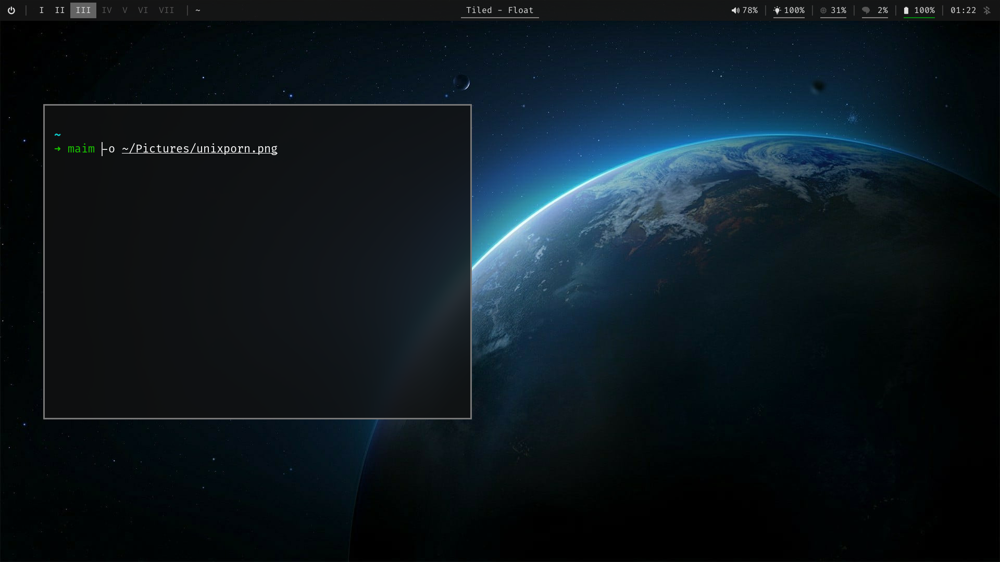

# dotfiles

This repo contains all the dotfiles I use on a regular basis. Do not expect the config files to be well written.

Uses my own custom DSL to manage the dotfiles in `dottyfile`. You can see the project in [the dotty repo](https://github.com/omfj/dotty).

## screenshots

## other

[You can also check out my fork of dwm and dwmblocks.](https://github.com/omfj/omfj-suckless)
